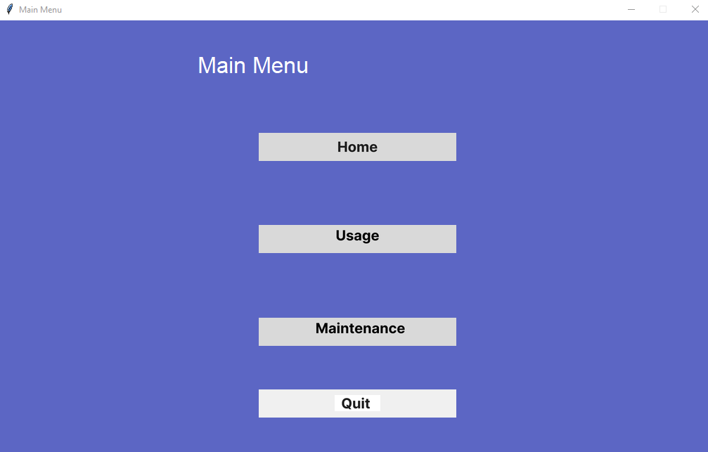

# Capstone project


## Refresher to add to get project cloned into system
<br>

1. Get link to clone by looking for the blue "Clone" button and copy the "Clone with SSH" link 
2. Go to your terminal and navigate to the folder where you want to have the project be
3. type ```git clone (paste link here)```


## Creating branches and pushing

Create a new branch:
1. Navigate to the folder where you have the project saved
2. in terminal type ```git checkout -b new-branch-name-here```

Adding/pushing new files:

 ```git add .
 git commit -m "Commit message here"
 git push origin branch-name-here
 ```

## Name
Nucleus

## Description
The Home IoT project will simulate sensor data and user interaction with a smart home.

# Launching
Run build/smart_home.py to start
Note: Inside build/assets there are frame folders which contain pngs of buttons.

## Usage


## Authors
Aaron Zheng<br>
Joel Garner<br>
Sophie Inchyna<br>
Nodira Berdieva <br>
Sam Price<br>
Kirby Russell<br>

